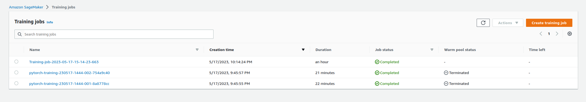
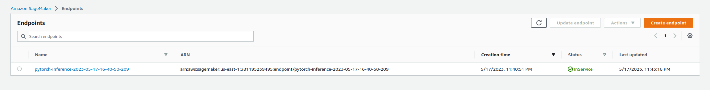

# Inventory Monitoring at Distribution Centers

## Project overview

- Distribution centers often use robots to move objects as a part of their operations. Objects are carried in bins which can contain multiple objects. In this project, you will have to build a model that can count the number of objects in each bin. A system like this can be used to track inventory and make sure that delivery consignments have the correct number of items.

- To build this project you will use AWS SageMaker and good machine learning engineering practices to fetch data from a database, preprocess it, and then train a machine learning model. This project will serve as a demonstration of end-to-end machine learning engineering skills that you have learned as a part of this nanodegree.

## Project Set Up and Installation

### Setup

- **Pipeline**:
    1. Upload Training Data: First you will have to upload the training data to an S3 bucket.
    2. Model Training Script: Once you have done that, you will have to write a script to train a model on that dataset.
    3. Train in SageMaker: Finally, you will have to use SageMaker to run that training script and train your model

- **Dependencies**:
    - Python version: `python>= 3.7`
    - Packages: you can install neccessary packages by executing the command: `pip install -r requirements.txt`

### Installation

- For this project, we strongly advise utilizing SageMaker Studio within the AWS workspace provided by the course. This approach will greatly streamline the setup process, reducing the need for complex installations.

## Dataset

### Overview

- For this project, we are utilizing the Amazon Bin Image Dataset. This dataset comprises 500,000 images, each showcasing a bin holding one or more items. Alongside each image, there is a metadata file that provides pertinent details such as the number of items in the bin, their dimensions, and their types. Our goal for this project is to develop a system capable of classifying the quantity of objects contained within each bin.

### Access

- In order to access the data for this project, we utilized the `boto3` library in `Python`, which allows for the creation, configuration, and management of AWS services.

- The `Amazon Bin Image Dataset` was originally stored in an Amazon `S3` bucket. Given the large size of the dataset, we decided to download a subset of the data for our initial analysis and model training. This is not only more efficient, but also cost-effective.

- We determined the subset of data to download using a file, `file_list.json`, which contains a list of the specific images we wanted to use from the larger dataset.

- The `boto3` library was then used to download these specific files from the `S3` bucket directly into our SageMaker notebook. The function to do this took the `S3` bucket name and the file paths from `file_list.json` as inputs, and then used the `download_and_arrange_data` method from the boto3 S3 client to retrieve these files.

- This approach allowed us to efficiently access a manageable subset of the data directly in our working environment, without the need to manually download and upload large amounts of data.

## Model Training

- For this project, the model chosen is a Convolutional Neural Network (CNN), specifically a pre-trained ResNet50 model, due to its high performance in image classification tasks. ResNet50 is a version of ResNet model that has 50 layers of depth, which makes it suitable for large scale image recognition.

- ResNet models are renowned for their ability to mitigate the problem of vanishing gradients, which is common in deep neural networks. This allows us to train deep networks that can learn more complex features from the images.

- A pre-trained model was used for this task, leveraging the concept of transfer learning, where a model pre-trained on a large dataset can be used, and fine-tuned, for a different but related task. This approach is beneficial when our dataset is relatively small, and it also saves a lot of time as the model has already learned useful features from a large dataset.

- The hyperparameters specified for the model include the learning rate and the batch size. The learning rate determines how much the model's weights are updated during training. Too high of a learning rate might cause the model to overshoot the optimal solution, while too low of a learning rate might cause the model to converge too slowly. The batch size, on the other hand, determines how many samples to work through before updating the model's internal parameters. The right batch size depends on the specific problem and the computational resources available. 

- The model's performance was evaluated based on its accuracy on the validation set. The model's accuracy metric tells us the proportion of images in the validation set that were correctly classified, which is a direct indicator of how well our model will perform on unseen data.

- Further tuning and testing might be necessary to improve the model's performance. Other metrics such as precision, recall, and F1 score could also be considered, especially if the dataset is imbalanced.

## Machine Learning Pipeline

1. **Data Preparation**: The first step in the pipeline is preparing the data for training. In this case, the Amazon Bin Image Dataset was used, which was already uploaded to an S3 bucket. Using Boto3, a Python library that allows you to directly interact with AWS services, a subset of the data defined in `file_list.json` was downloaded for use in the project.

2. **Preprocessing**: The downloaded images were then preprocessed to be suitable for training a Convolutional Neural Network. This included steps such as resizing the images to a uniform size, normalizing the pixel values, and converting the labels into a format that the model can understand.

3. **Model Training Script**: Once the data was ready, a PyTorch script was written to define and train the model. The script included the model architecture (a pre-trained ResNet50 model was used), the loss function, and the optimization method. It also defined the training procedure, specifying how the data should be fed into the model, and how the model's parameters should be updated.

4. **Training in SageMaker**: With the training script ready, the next step was to set up a training job in SageMaker. This was done by defining a PyTorch estimator, specifying the type and number of instances to use for training, and the location of the training data in S3. The estimator was then fit on the training data, which initiated the training job. SageMaker took care of downloading the data from S3, running the training script, and saving the trained model artifacts back to S3.

5. **Model Evaluation**: After training, the model was evaluated on a separate validation dataset to assess its performance. The accuracy of the model's predictions was used as the main metric.

6. **Deployment**: Finally, the trained model was deployed to a SageMaker endpoint. This makes the model available for online prediction requests. The endpoint can be accessed via an API, making it possible to integrate the model into applications.

